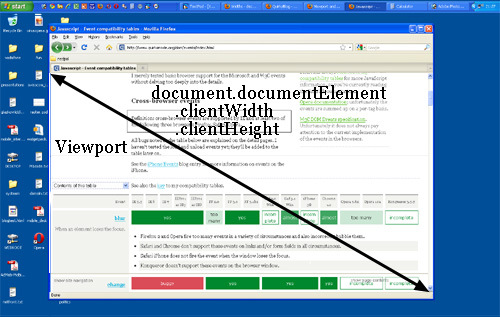

>原文：[A tale of two viewports — part one](http://www.quirksmode.org/mobile/viewports.html)  
时间：20160413

## 前言
本文翻译自ppk（Peter-Paul Koch）对于前端中viewport的理解和分析，由于个人能力所限，文章难免出现翻译问题，希望大家多多指正。


## 两种viewport的故事（一）
**在这部迷你的viewport系列文章中，我将解释viewports和一些重要元素宽度的计算是如何工作的，比如html标签元素，以及window和screen等。**  

这篇文章是关于桌面浏览器，唯一的目的是为后面讨论移动端浏览器奠定基础。大多数web开发者在直觉上能够了解桌面（desktop）的相关概念。在移动端，我们也可以发现同样的概念，但是更加复杂。我们首先讨论桌面浏览器，这对于我们理解后面讨论的移动端浏览器将有很大的帮助。

### 概念：设备像素和CSS像素
你需要了解的第一个概念是CSS像素，以及它与设备像素之间的区别。  

设备像素就是我们通常理解的像素，即屏幕上显示的一个最小发光像素点。我们常常说的屏幕分辨率指的就是有多少个这样的像素的集合。我们可以调用screen.width/height来获取屏幕设备像素的宽度和高度。  

如果你的屏幕的宽度是1024px（指设备像素，分辨率宽度），你设置一个元素`width: 128px;`（CSS像素），当你将元素布局在整个浏览器时，这个元素将你在浏览器上进行八次适配 （1024/128=8，在这里我们暂不讨论其中的过程）。  

如果用户缩放窗口，元素的适配计算次数就会改变。比如用户将窗口放大到200%，设置`width:128px;`的元素此时只用进行4次适配（1024/256=4）。  

缩放在现代浏览器中的实现其实只是将像素进行拉伸，但这并不意味着你设定的CSS像素128px会改变为256px，而是1个CSS像素点包含了2个设备像素点。所以缩放正式的渲染方式是：我们在CSS像素层面设置的元素的宽度依然是128px，只是在现在在浏览器上时，这个元素占据了256个设备像素的空间。  

换句话说，将元素放大至200%使得一个CSS像素点增大到一个设备像素点的4倍（宽度2倍，高度2倍，总共4倍）。  

下面的几张图将更清楚的描述这个过程。其中深蓝色表示设备像素层面，浅蓝色表示CSS像素层面。  

  
图1 无缩放100%大小  

  
图2 元素缩小后的情况

  
图2 元素放大后的情况

在图1中没有缩放，此时设备像素和CSS像素是完全重合，相同大小的；图2中元素缩小后，此时1个设备像素点可能包含了多个CSS像素点；图3中元素放大后，此时1个CSS像素点可能包含了多个设备像素点。  

在实际情况中，我们其实只关心CSS像素点，因为只有CSS像素点影响了整个样式表的渲染。  

设备像素几乎对你来说并没有什么用处。但对于用户可能有时会关注，因为用户有时需要将网页缩放，以至于他们能看清网页的内容。但是对于开发者，这并不会影响到你，浏览器的内部机制会自动进行调整，确保你的CSS布局拉伸和缩小。  

**100%的缩放**  
我开始研究的例子的缩放级别为100%。也时候给出更加严格的定义了：
>100%的缩放级别，1个CSS像素点和设备像素点是准确相同的

100%的缩放在我们解释上述概念的时候十分有用，但是你不需要过分的担心平常的工作。在桌面浏览器上你只需要以100%的缩放测试你的页面即可，即使用户放大或缩小页面时，浏览器也能够按相同的比率来显示你的页面不被破坏。

### 显示器尺寸（Screen size）
我们先做一些实际的测量。首先从`screen.width`和`screen.height`开始。它们测量的是用户显示器的的宽和高。这个层面的值测量的是设备像素，也就是我们理解的屏幕分辨率。这两个值是固定值，不会改变，只和用户的显示器有关，和浏览器没有任何关系。  

  

这看起来很有趣，但是对于这些数据能干什么呢？  

老实说，并没有什么用。用户的浏览器的尺寸对于我们来说并不重要，除非你只是想测量一下，然后存在统计数据库里面。  

### 界面尺寸（Window size）
事实上，我们需要知道的是浏览器界面的尺寸。这些数据将准确的告诉你用户界面有多少空间可以给你做CSS布局。你可以通过`window.innerWidth`和`window.innderHeight`来侧量页面的宽和高。  

  

很明显，界面的宽和高测试的是CSS像素层面上的值。你需要知道你能够在浏览器页面中塞下多少布局元素和当用户放大页面时有多少元素被减少了。所以当用户放大了页面，页面提供可见的元素将变少，`window.innerWidth`和`window.innderHeight`也随之减小（Opera浏览器例外，其测试是界面在设备像素层面的值，可以对比下图与上图的区别）。  

  

注意：宽和高的测量值包括了滚动条。它们同样被认为是inner window的一部分（历史遗留原因）。

### 滚动偏移值（Scroll offset）
`window.pageXOffset`和`window.pageYOffset`，包含了document的水平和垂直的滚动偏移值。所以你能够得到用户将页面滚动了多少。  

  

这些属性的测量也是在CSS像素层面的。无论页面是否为放大状态，如果你想知道document已经被滚动了多少距离，就可以调用这两个属性（ps.我在测试页面放大和缩小时，Y轴上有细微的变化）。  

理论上，如果用户下滑且放大页面时，window.pageX/YOffset将要改变。但是，浏览器为了保持页面在放大的状态下显示元素的一致性，会尽量保持window.pageX/YOffset不变，在实际效果做测试也是这样的（ps.这段我做了根据文中意思，翻译上做了一些调整，以便理解）。  

  

### 概念：viewport
在我们讨论更多的JavaScript属相之前，我们必须介绍林另外一个概念：viewport。  

viewport的作用是束缚页面的html根元素。这样听起来似乎有点模糊，我们来给一个具体的例子吧。假如你有一个流式的布局，且你的侧边栏定义`width: 10%`。当你在缩放界面时，侧边栏也会相应的增大和减小。但是这个过程具体是怎么工作的呢？  

从技术层面上，侧边栏从父级元素那里继承了10%的宽度。我们把body当做这个父级元素（同时你对body元素没有设置具体的width）。所以问题就变成body元素的width是多少了。  

通常，所有的块级元素将占据父级元素100%的宽度（这里有一些例外，我们暂时不考虑）。所以body元素的width值等于它的父级元素，即html元素。  

但是html元素的宽度是多少呢？事实上，它的宽度浏览器的宽度相等。这就是为什么你的侧边栏会占据浏览器宽度的10%。所有的web开发者在直觉上知道并一直在使用它。  

你不知道的可能是在理论上是如何工作的。在理论上是这样定义的：html元素的宽度被viewport严格限制，html元素占据了viewport的100%的宽度。而viewport又与浏览器宽度准确的相等。这个viewport不是HTML的构造器，所以你不能通过CSS来影响它。在只是拥有浏览器的宽和高而已--在PC端。而在移动端会变的更加复杂。  

**造成的后果**
这一系列的规范造成了一些怪异的行为。在这里你讲看见一个，如下图。将页面滚动至最顶端，并放大一定倍数，使得页面内容区溢出了浏览器可见的范围。  

现在向右滚动，你将看见顶部的蓝色条并没有很好的显示。  

  

这个怪异的行为的出现是由于viewport的定义。在页面中，我定义了蓝色条CSS演示`width:100%;`。100%相对谁呢？当然是相对html元素，同样也是viewport，宽度等于浏览器的界面宽度。  

关键点：当网页工作再100%的缩放比例时不会出现任何问题，当我们放大页面时，viewport的范围就开始小于页面了，对于页面的本身并不造成什么影响，但是页面的内容会溢出html元素，由于overflow的默认属性是visible，所以内容会超出父级元素而显示出来。  

但是蓝色条并不出溢出显示。虽然我设置了`width: 100%`，但是其毕竟是相对于viewport的宽度，其并不关心viewport是否小于页面的大小。  

  

**文档宽度（ducument width）**

### 测量viewport
你可能想知道viewport的尺寸。你可以通过`document.documentElement.clientWidth`和`-Height`得到（ps.这一对属性的值并不包括滑动条）。  

  

如果你了解DOM，你可能知道`document.documentElement`表示的是html元素：HTML文档的的根元素。但是viewport比html元素更高一层，它包含了html元素。然后你直接给html元素设置宽度，可能有一些不合适（虽然这样可以这样设置，但我并不推荐这样）。  

在上述的这种情况下，`document.documentElement.clientWidth`和`-Height`虽然设置是html的宽和高，其实是作用于viewport，而不是html元素（这条规则只针对这个元素的这个属性对，其他的情况设置的依然是对应的元素的属性值）。  

  

从上图可知`document.documentElement.clientWidth`和`-Height`实际设置的是viewport的值，与html元素没有任何关系。

**两对属性**  
可是viewport的尺寸大小不应该是`window.innerWi/Height`设置的吗？其实也可以说是，也可以上不是。  

关于这两对属性，在规范里有一定的区别：`document.documentElement.clientWidth`和`-Height`不包括滚动条，而`window.innerWi/Height`包括滚动条。虽然这看起来有点吹毛求疵。  

事实上这是当年浏览器战争留下的问题，在以前，网景公司的浏览器只支持`window.innerWi/Height`，而IE只支持`document.documentElement.clientWidth`和`-Height`，后来再浏览器的发展过程中，越来越多的浏览器开始支持`document.documentElement.clientWidth`和`-Height`，而IE却迟迟不支持`window.innerWi/Height`。  

在桌面浏览器上同时提供这两对属性确实有点让人感到讨厌--但对于移动端来说却是一个福音，接下来我们将一一分析。  

### 测量html元素
`clientWidth/Height`在设置viewport的尺寸时兼容性不存在问题。但是我们通过什么方式可以得到html元素的尺寸呢？它们可以通过`docuement.documentElement.offsetWidth`和`-Height`来得到。  

  

这两个属性提供了设置html元素的方法，如果你设置相应的宽度，offsetWidth将会在html元素中体现出来。  

  

### 事件坐标
接着我们谈论的是事件坐标。当鼠标事件被触发，多达5个属性对可以为你提供具体的事件触发位置。对于我们来说下面三个属性对是我们关系的。  

  - **pageX/Y** 提供在CSS像素层级相对于html文档中的坐标位置；
  - **clientX/Y** 提供在CSS像素层级相对于viewport的的坐标位置；
  - **screenX/Y** 提供在设备像素层级相对于屏幕的的坐标位置  

  pageX/Y clientX/Y screenX/Y  

    

  一般90%的情况，你将使用`pageX/Y`，因为你关心的是点击事件相对于document的位置；剩下的10%情况，你可能会用`clientX/Y`，这是你能得到点击事件相对于viewport的位置。

### 媒体查询
最后，我们谈一下媒体查询。想法很简单：你能定义一些特殊的CSS样式在特定的页面宽度下执行。比如：

```css
div.sidebar {
  width: 300px;
}

@media all and (max-width: 400px) {
  //styles assigned when width is smaller than 400px;
  div.sidebar {
    width: 100px;
  }
}
```

现在sidebar是300px宽，如果你将整体宽度缩小至400px以下，则sidebar的宽度变为100px。  

那么问题来了：这里的整体的宽度指的是什么呢？  

实际上有两种相关的媒体查询：`width/height` 和`device-width/device-height`。

> 1. `width/height`的值相当于`document.documentElement.clientWidth`和`-Height`（实质上指viewport大小），在CSS像素层级。
> 2. `device-width/device-height`的值相当于`screen.width/height`（实质上指屏幕的大小），在设备像素层级。

  

那么你要用哪一种呢？当然是`width/height`。web开发者并不用关心设备像素的宽度，那只是屏幕上一堆像素点的集合而已。

所以在PC端放心用`widht/height`，忘掉`device-widht/device-height`。就像我们看到的，在移动端情况就变的麻烦了。  

### 总结
上述我们介绍了PC端的浏览器行为。在第二部分中我们将这些概念应用在移动端，并重点强调与PC端之间的不同。
