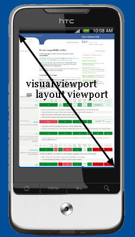
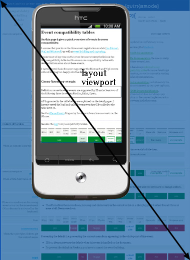
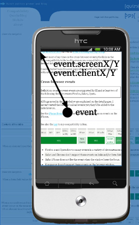
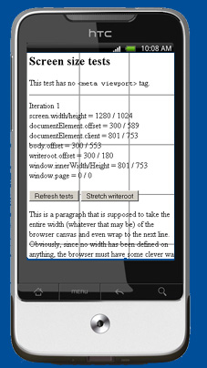

> 原文：[A tale of two viewports — part two](http://www.quirksmode.org/mobile/viewports2.html)  
时间：20160419

## 前言
本文翻译自ppk（Peter-Paul Koch）对于前端中viewport的理解和分析，由于个人能力所限，文章难免出现翻译问题，希望大家多多指正。

## 两种viewport的故事（二）
**在这部迷你的viewport系列文章中，我将解释viewports和一些重要元素宽度的计算是如何工作的，比如html标签元素，以及window和screen等。**  

在这篇文章中，我们打算讨论移动端浏览器。如果你是一个移动端的新手，我建议你先读一下[两种viewport的故事（一）](http://www.quirksmode.org/mobile/viewports.html)，因为两者有一些共通的地方。  

### 移动端浏览器的问题
当我们比较移动端和PC端的浏览器时，最大的区别就是屏幕的尺寸大小。对于那些对PC端浏览器做了优化的网站，移动端浏览器显示时，用户体验明显下降了许多，要么是网页缩小了很多以至于看不见字体，要么是只显示了网页的部门内容。  

移动端屏幕比PC端要小很多，最大也只有400px宽，优势可能会更小。（有一些手机厂商宣称有较大的屏幕尺寸，其实他们在撒谎或者很少--通过我们现在了解的信息）。  

一系列平板电脑像ipad或者传说中的HP webOS-based one将在PC端和手机端搭起一座桥梁，但这并没有改变原始的问题。网页必须工作都在移动端设备，所以我们必须处理他们在小屏上显示的问题。  

最重要的问题在与CSS，特别是viewport的尺寸。如果我们讲PC端的模型完全复制过来，那么我们的CSS可能就会出现不可想象的问题了。  

让我们在回到设置`width:10%`的侧边栏。如果移动端浏览器与PC端采用相同的方式显示，那么这个侧边栏最多只有40px的宽度，这太窄了。你的流动布局将看起来很糟糕。  

一个解决方案是针对移动端建立特殊的网页。即使我们先暂时不考虑你是否要解决网页在小屏上的显示问题，还有一个实际的问题是网站的维护者很少希望他们的网页在移动端另做一套。  

移动端浏览器希望提供最好的用户体验，尽量与PC端近似。所以出现一些解决办法。  

### 两种viewport
当应用CSS样式时，在移动端显示太窄。一个明显的解决方案就是使viewport更宽。正式因为这个原因，我们把viewport分为两种：visual viewport、layout viewport。  

George Cummins在Stack Overflow上是这样解释这两个概念的：  

> 我们把layout viewport作为一个不会改变大小和形状的图片。现在你希望通过更小的视框来看清这个图片。你通过小的视框只能看见图片中的部分内容，但是在小的视框周围，隐藏了你看不到的图片的其他部分，我们称这个小的视框为visual viewport。你可以通过缩小来看到整个图片的大小，同时你也可以通过放大来看清某一部分的内容。你可以改变小的视框所看见的范围，但是大的图片（layout viewport）是不会改变的。

也可以看Chris的[解释](http://stackoverflow.com/questions/7344886/visual-viewport-vs-layout-viewport-on-mobile-devices)  

visual viewport只在屏幕上显示了网页的部分内容。用户通常使用滚动条或者缩放来查看其它部分的内容。  

  

但是，在CSS布局中，特别是百分比宽度，是根据layout viewport计算的。而layout viewport的大小明显比visual viewport更大。  

html元素是以layout viewport的大小进行初始化的，所以当CSS样式在应用的时候，你感觉渲染的页面的大小比手机屏幕要大很多。采用这种方式也是为了在移动端显示的效果与PC端保持一致。  

但是layout viewport的宽度到底是多少呢？浏览器的不同会导致layout viewport宽度不一样。一般Safari为980px，Opera为850px，Android webkit为800px，IE为974px。  

其他一些浏览器可能会有一些特殊的行为：  
  - 塞班webkit会试着将layout viewport和visual viewport的大小保持一致，就像你能想象的那样，当元素应用百分比时，显示的效果会很奇怪。但是，如果页面在visual viewport塞不下，浏览器也会将layout viewport拉伸，最大为850px。
  - 三星webkit（bada）将layout viewport的宽度定义为与最宽的元素相同。
  - 在蓝莓手机上，layout viewport以visual viewport的100%的缩放比例显示。

**缩放**  
很明显，两种viewport的宽度都是在CSS像素层面定义的。但是当visual viewport的尺寸改变时（假如你放大网页，屏幕上显示了更少的CSS像素点），但是layout viewport的尺寸将保持不变。  

**理解layout viewport**  
为了了解layout viewport的尺寸，我们先看一下当页面缩小至可以看见整体时的情况。一些移动端浏览器在初始化显示页面时会默认缩放至最小。  

关键在于：此时的浏览器已经将页面完全显示在移动端屏幕上，与visual viewport相等。  

  

layout viewport的宽度和高度始终与缩放至最小时的页面是成比例的，不会改变，在用户放大界面时也是如此。  

  

layout viewport的宽度始终保持一致，如果你旋转你的屏幕，visual viewport会改变，浏览器会根据新的宽度尺寸来相应的缩放页面。  

  

手机的水平放置会对layout viewport的高度有一些影响，可以看见高度明显小于垂直时候的状态。但是web开发者并不关心高度，他们只关心宽度而已。  

  

### 测量layout viewport
现在我们有两个viewport需要测量，所以应该庆幸的是在浏览器战争中留下的两对属性。  

`document.documentElement.clientWidth`和`-Height`测量layout viewport的尺寸。  

  

手机水平放置时会影响高度，但不影响宽度。  

  

### 测量visual viewport
对于visual viewport，可以采用`window.innerWidth/Height`获取。很明显，当用户缩放页面时，对应的测量值会改变，因为更多或者更少的CSS像素点被包括在屏幕里了。  

  

不幸的是这对属性存在兼容性问题，一些浏览器仍然需要进一步更新才能测量visual viewport的尺寸。同样，现在也没有任何一款浏览器提供新的属性可以测量visual viewport的尺寸，所以我推测`window.innerWidth/Height`是一个标准，但是浏览器支持的并不好。  

### 屏幕（The screen）
在PC端，`screen.width/height`给出了在设备像素层面屏幕的尺寸。在PC端，对于web开发者来说，这对值并没有什么用处。你并不关心屏幕的物理尺寸是多少，你只关心有多少CSS像素点包含在屏幕中。  

  

**缩放比例**  
我们不能直接读出页面的缩放比例，但是可以通过`window.innerWidth`除以`screen.width`得到。当然前提是这两个属性都被浏览器所支持。  

所幸的是你不需要知道缩放比例是多少。你需要知道的是有多少个CSS像素点在屏幕上。你能通过`window.innerWidth`的值来获取--前提是浏览器支持。  

### 滚动偏差值（Scroll offset）
你同样需要知道的是visual viewport相对于layout viewport的偏移值是多少。我们称之为滚动偏移值，在PC端中，我们可以通过`window.pageX/YOffset`来获取。  

  

### html元素
和PC端一样，`document.documentElement.offsetWidth/Height`给出了整个html文档的大小尺寸（CSS像素层面）。  

  

### 媒体查询（media queries）
在移动端，媒体查询工作原理与PC端一样。`width/height`利用layout viewport作为参考对象，并计算相应的CSS像素值，`device-width/height`利用设备像素作为参考，并计算相应的设备像素值。  

换句话说，`width/height`是`document.documentElement.clientWidth/Height`的一个镜像；`device-width/height`是`screen.width/height`的一个镜像。（在所有的浏览器中都表现如此，即使测量值不正确的情况下也是）  

  

现在来看，哪一种测量值对于web开发者更有用呢？关键是我也不知道。  

我从一开始认为`device-width`更加重要，因为它提供我们一些我们可能需要用的设备信息。比如，你可以改变你的布局宽度以便设备可以容纳。但是，你也可以利用meta viewport标签来解决；对于利用`device-width/height`做媒体查询并不是绝对上不可或缺的。  

所以`width`是更加重要的吗？可能吧；它给浏览器提供一些信息，包括什么样的网页宽度是适合这个设备的。但除了这个信息，基于`width`的媒体查询并不能提供其他信息了。  

所以我也不能决定哪个更加重要。暂时我认为媒体查询的作用是区分出你是在PC端、平板还是移动设备，但是对于区别具体某一类平板或者移动设备并起不了多大的作用。

### 事件坐标
移动端的事件坐标与PC端差不多。不幸的是，我们通过对12款浏览器的测试中，只有塞班webkit和Iris对三对属性支持的比较好。其他的浏览器多多少少都有些问题。  

`pageX/Y`同样是相对于CSS像素，和PC端上一样，它也是在三对属性中最有用的一对。  

  

`clientX/Y`是在CSS像素层面，相对于visual viewport的坐标值。这很容易理解，虽然我还没完全确定它的好处是什么。  

`screenX/Y`是在设备像素层面，相对于屏幕的坐标值。当然，它的参考物同`clientX/Y`相同，不过设备像素的值没有什么作用。所以同PC端上一样，我们不用太关注`screenX/Y`。

  

### meta viewport
最后，我们讨论一下

```html
<meta name="viewport" content="width=320">
```

最开始是由apple公司提出来的，后来很多其他浏览器也实现了这个功能。它的作用是告诉浏览器重新设置layout viewport的大小。为了更好的理解它的必要性，我们来回想一下。  

假如你编写了一个页面，但是并没有设置width。当它们呈现在浏览器中时，会根据layout viewport的值进行100%的拉伸。大多数移动端的浏览器会缩小页面以便能够将layout viewport完全显示在屏幕中。比如下图：  

  

所有的用户都会立即放大页面。但是放大页面后，浏览器还是会完整的保持元素的宽度，这使得阅读有时候会的困难，如图：  

  

（这里有一个特例是Android webkit，它会减小文本元素的尺寸以至于适合屏幕阅读。这种方式很巧妙，我觉得所有的浏览器都应该采取这种策略）  

现在你在html中设置了`html {width: 320px}`。html元素将会缩小，其他的元素相应的也会缩小，整个html文档的宽度是320px。但是只有当用户放大时这个设置才起作用，并不是在初始化的阶段。如果用户以缩小的方式操作，那么这个设置可能就起不了什么作用了。  

  

为了解决这个问题，apple公司就在html中添加了一个meta标签  

```html
<meta name="viewport" content="width:320px">
```

你可以设置页面初始化的的layout viewport的宽度。现在初始化的宽度问题已经解决了，如图：  

  

对于layout viewport的尺寸，你可以设置任何值，包括设备的屏幕宽度（device-width）。在这里`screen.width`（设备像素层面）作为参考对象来重设layout viewport的宽度。  

这里还要注意一点的是，当屏幕的分辨率过高时，`screen.width`的值并不具有很大意义。比如，Nexus One的分辨率的宽度达到了480px，但是Google的工程师们觉得参考divice-width设置layout viewport的宽度为480太宽了，所以他们以屏幕分辨率宽度的2/3，即320px，作为layout viewport的显示宽度，和iPhone一样。  

新的iPhone如果像谣传的那样增大屏幕的分辨率，那我并不会惊讶苹果会沿用Google工程师的这种做法。可能最后的device-width也是320px。（ps.本篇文章是写在苹果手机retina屏出现之前，现在证实ppk大神的预测完全是对的。）
